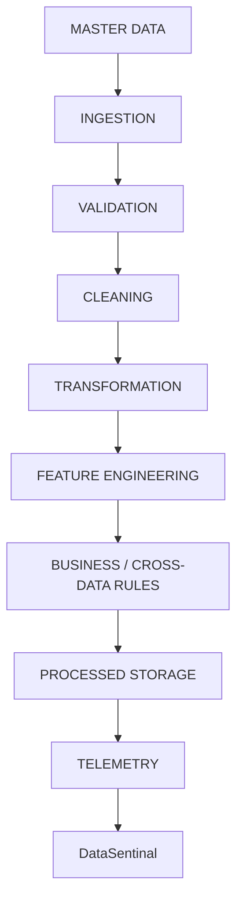

# Pipeline Design

The representative pipeline will be developed in stages:

1. Ingestion
2. Schema/Data Validation
3. Cleaning
4. Transformation
5. Feature Engineering
6. Business Rules / Cross-Dataset Validation
7. Processed Storage
8. Orchestration
9. Telemetry

## Conceptual Flow

**Rule:** Do NOT allow an agent to skip directly into later stages without understanding the dependencies.
