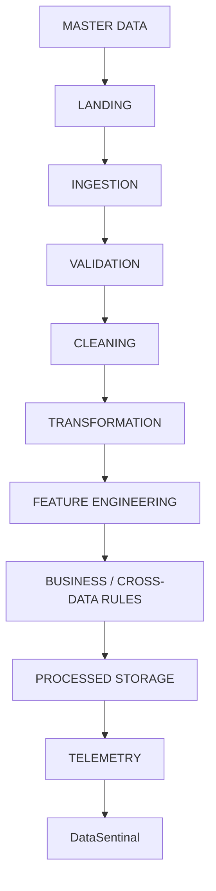

# Pipeline Design

The representative pipeline will be developed in stages:

1. Landing
2. Ingestion
3. Schema/Data Validation
4. Cleaning
5. Transformation
6. Feature Engineering
7. Business Rules / Cross-Dataset Validation
8. Processed Storage
9. Orchestration
10. Telemetry

## Conceptual Flow

**Rule:** Do NOT allow an agent to skip directly into later stages without understanding the dependencies.
