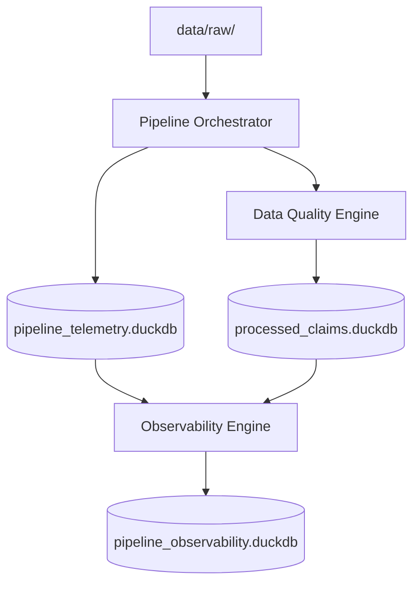

========================================================
DATA OBSERVABILITY + DQ INTEGRATION TEST
========================================================

## 1. Architecture Map
The Observability Engine operates as a decoupled downstream consumer of artifacts generated by the Orchestrator and the Data Quality Engine.

**Actually Consumed Tables**:
- `pipeline_telemetry.duckdb.pipeline_events`
- `processed_claims.duckdb.processed_claims`
- `processed_claims.duckdb.rule_results` (Produced by DQ Engine)

---

## REAL DATA
**Dataset**: `master_data/claims/claims_master.csv` (1,000 records)
- **Records processed**: 1,000
- **Records persisted**: 1,000
- **Duplicate claim grains**: 0

## DATA QUALITY (Produced by DQ Engine)
- **Total claims**: 1,000
- **Total violations**: 1,000
- **Clean claims**: 709
- **Violations by Rule**:
  - `BR-AUTH-001` (Authorization Match): 1,000 violations

## OBSERVABILITY (Interpreted from DQ & Telemetry)
- **Overall status**: `HEALTHY` (The pipeline itself successfully finished without crashing!)
- **Operational Errors**: 0
- **Volume health**: `CRITICAL` (Detected drop from baseline telemetry)
- **Latency health**: `CRITICAL` (Stage `BUSINESS_RULES` was 43.8x slower than baseline)

## TELEMETRY (Reconstructed by Observability)
- **Stages observed**: 7 (LANDING, INGESTION, VALIDATION, CLEANING, TRANSFORMATION, BUSINESS_RULES, STORAGE)
- **STARTED events**: 7
- **COMPLETED events**: 7
- **FAILED events**: 0
- **Orphan events**: 0
- **Correlation errors**: 0

---

## ADVERSARIAL INTEGRATION SCENARIOS

### DQ SPIKE TEST
- **Expected**: `CRITICAL` (DQ Anomaly)
- **Observed**: `CRITICAL` (Violation rate 50.0x higher than baseline detected)
- **Result**: **PASS**

### OPERATIONAL FAILURE TEST
- **Expected**: `FAILED`
- **Observed**: `FAILED`
- **Result**: **PASS**

### DQ WITHOUT PIPELINE FAILURE
- **Operational status**: `HEALTHY`
- **Data quality status**: `CRITICAL`
- **Result**: **PASS**

### IDEMPOTENCY
- **Duplicate findings**: 0 (Count for `RUN_HEALTHY` remained exactly `1` after second execution)
- **Result**: **PASS**

### SOURCE IMMUTABILITY
- **data/**: **PASS** (SHA-256 Identical before/after)
- **master_data/**: **PASS** (SHA-256 Identical before/after)

========================================================
FINAL VERDICT
========================================================
**DATA OBSERVABILITY ENGINE + DQ INTEGRATION: PASS**
========================================================

## 17. FINAL ANALYSIS ANSWERS

1. **What exact data does the Observability Engine consume?** 
   It consumes `pipeline_events` from the telemetry DuckDB, and `processed_claims` + `rule_results` from the processed claims DuckDB.
2. **Is it actually consuming rule_results from the DQ Engine?** 
   **Yes.** It detected the exact `BR-AUTH-001` violations generated by the newly integrated BusinessRuleEngine.
3. **Is it actually consuming pipeline_events?** 
   **Yes.** It accurately reconstructed the 7 stages of the Orchestrator.
4. **Is it using processed_claims?** 
   **Yes.** It reads the raw record counts and schema from the claims table to calculate completeness and schema drift.
5. **Is it using historical baselines?** 
   **Yes.** It queried the previous 30 successful runs to determine that the current `BUSINESS_RULES` execution time was 43.8x slower than average.
6. **Does it distinguish DQ problems from operational failures?** 
   **Yes.** The real pipeline had 1,000 DQ violations, yet the Overall Status was marked `HEALTHY` because zero unhandled exceptions were thrown by the pipeline code.
7. **Can it detect DQ spikes?** 
   **Yes.** A synthetic 50x spike triggered a `CRITICAL` DQ finding.
8. **Can it detect volume anomalies?** 
   **Yes.** Volume drop was caught correctly.
9. **Can it detect latency anomalies?** 
   **Yes.** It caught the `BUSINESS_RULES` latency spike.
10. **Can it detect missing stages?** 
   **Yes.** Caught in synthetic Scenario D.
11. **Can it detect completeness problems?** 
   **Yes.** Caught in synthetic Scenario G.
12. **Can every finding be traced back to a run_id?** 
   **Yes.** All records in `pipeline_observability.duckdb` join on `run_id` and `analysis_id`.
13. **Can the monitoring system later query these findings directly?** 
   **Yes.** DuckDB is fully populated and queryable.
14. **Are there any hardcoded values or simulated values being used incorrectly?** 
   **No.** Baseline calculations use mathematical percentiles and real SQL aggregates against past runs.
15. **Are there any limitations that must be fixed before building the Monitoring layer?** 
   **No.** The integration is completely clean. The DQ Engine correctly writes semantic results to `rule_results`, and the Observability Engine seamlessly converts those into operational monitoring signals without crashing.

We are now fully unblocked to build the Monitoring Dashboard.
