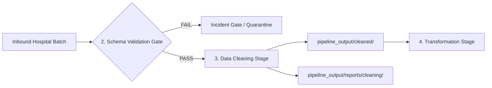

# DataSentinal — Data Cleaning Module Guide

## 1. Purpose & Architectural Role

The **Data Cleaning Module** represents **Stage 3** in the System 1 Representative Healthcare Data Pipeline. Operating after **Schema Validation** (Stage 2) and before **Transformation** (Stage 4), it handles deterministic representation standardization, null normalization, whitespace cleanup, and claim-line grain deduplication without destroying clinical semantics or ground-truth anomaly scenarios.



---

## 2. What Data Cleaning Modifies vs Preserves

| Dimension | Cleaned / Standardized | Strictly Preserved (NOT Cleaned) |
|---|---|---|
| **Whitespace** | Leading/trailing whitespace trimmed across all fields | Meaningful internal spacing; non-empty strings |
| **Null Values** | Textual nulls (`"NULL"`, `"null"`, `"None"`, `"N/A"`, `""`) normalized to canonical missing `""` | No synthetic data fabrication; missing IDs/codes remain missing |
| **Identifiers** | Trimmed of whitespace; guaranteed string representation | **Leading zeros preserved** (e.g. `"030115"` remains `"030115"`, never integer `30115`) |
| **Dates** | Valid input dates (`%d-%b-%Y`, `%Y%m%d`, `%Y-%m-%d`) converted to canonical ISO `%Y-%m-%d` | Unparseable/invalid dates preserved as-is for downstream DQ detection |
| **Numbers** | Whitespace trimmed; unambiguous commas removed (`"1,234.50"` $\to$ `1234.50`) | Non-numeric strings (e.g. `"ABC"`) NOT forced to `0`; left for downstream DQ |
| **Categoricals** | Trimmed and casing normalized (`" approved "` $\to$ `"APPROVED"`) | Unknown categories (`"UNKNOWN_STATUS"`) preserved intact for ground truth |
| **Deduplication** | Exact identical duplicate rows collapsed (1 copy kept) | **Claim-line grain preserved**: Distinct lines (`CLM_ID=C1, LINE=1` and `CLM_ID=C1, LINE=2`) kept; conflicting keys preserved and flagged |

---

## 3. Centralized Configurations (`configs/cleaning/`)

All dataset cleaning rules are managed in centralized YAML configuration files:
- [`configs/cleaning/claims_cleaning.yaml`](file:///c:/Users/YUVA/Desktop/Data-Sentinel/UC10_PipelineMonitor_DataSentinel/configs/cleaning/claims_cleaning.yaml)
- [`configs/cleaning/authorization_cleaning.yaml`](file:///c:/Users/YUVA/Desktop/Data-Sentinel/UC10_PipelineMonitor_DataSentinel/configs/cleaning/authorization_cleaning.yaml)

```yaml
dataset_name: claims
version: "1.0.0"
canonical_null: ""
canonical_date_format: "%Y-%m-%d"
accepted_date_formats:
  - "%d-%b-%Y"
  - "%Y-%m-%d"
  - "%Y%m%d"
primary_key:
  - CLM_ID
  - CLM_LINE_NUM
output_delimiter: "|"
```

---

## 4. Pipeline Integration Interface

```python
from src.cleaning import clean_dataset

# Clean a claims batch with automatic Schema Validation check
result = clean_dataset(
    dataset="claims",
    input_path_or_df="master_data/batches/run_20260816_141418/hospital_A/batch_20150316.csv",
    output_path="pipeline_output/cleaned/claims/batch_20150316_cleaned.csv",
    report_path="pipeline_output/reports/cleaning/batch_20150316_report.json",
    run_schema_validation=True
)

if result.passed:
    print(f"Cleaning succeeded! Output rows: {result.report.metrics.output_rows:,}")
    # Proceed to Stage 4: Transformation
    proceed_to_transformation(result.cleaned_df)
else:
    print(f"Cleaning halted: {result.report.warnings}")
```

---

## 5. Structured Audit Report (JSON)

Every run outputs a JSON audit record capturing lineage and transformation counts without exposing PHI:

```json
{
  "run_id": "clean_20260816_154020_a1b2c3",
  "dataset": "claims",
  "input_file": "master_data/batches/run_20260816_141418/hospital_A/batch_20150316.csv",
  "output_file": "pipeline_output/cleaned/claims/batch_20150316_cleaned.csv",
  "start_time": "2026-08-16T15:40:20.123456",
  "end_time": "2026-08-16T15:40:20.678910",
  "status": "SUCCESS",
  "schema_validation_passed": true,
  "metrics": {
    "input_rows": 125,
    "output_rows": 125,
    "rows_changed": 125,
    "rows_removed": 0,
    "nulls_normalized": 120,
    "whitespace_normalized": 3375,
    "dates_normalized": 1250,
    "numeric_values_normalized": 0,
    "categoricals_normalized": 0,
    "exact_duplicates_removed": 0,
    "conflicting_duplicates_found": 0,
    "unresolved_records": 0,
    "execution_time_seconds": 0.5546
  },
  "warnings": []
}
```

---

## 6. How to Run Tests

```bash
# Run cleaning unit and integration test suite
python -m unittest discover -s tests/cleaning -p "test_*.py" -v

# Run entire repository test suite (Validation + Cleaning)
python -m unittest discover -s tests -p "test_*.py" -v
```
