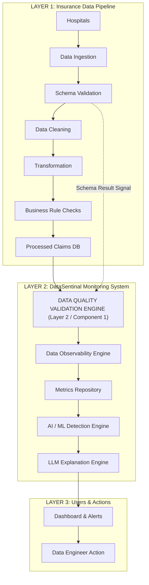

# DataSentinal — Data Quality Validation Engine Guide
# Layer 2 / Component 1 Implementation

## 1. Purpose & Architectural Context

The **Data Quality Validation Engine** represents **Layer 2 / Component 1** of the DataSentinal healthcare monitoring system. Sitting directly adjacent to the operational pipeline, it performs non-mutating (read-only) evaluations of inbound and processed healthcare datasets against centralized, configurable quality rules.



---

## 2. Separation of Concerns: Schema Validation vs. Data Quality Engine

| Dimension | Schema Validation (`src/validation/`) | Data Quality Engine (`src/data_quality/`) |
|---|---|---|
| **Core Question** | *"Does this dataset conform to its structural schema?"* | *"Does the data satisfy its logical and domain quality expectations?"* |
| **Scope** | Physical file readable, column existence, datatypes, syntax patterns, delimiter validity. | Null/blank thresholds, claim-line composite uniqueness, non-negative amounts, date chronology, cross-dataset referential integrity. |
| **Integration** | Acts as an upstream structural gate. | Consumes the `ValidationResult` from Schema Validation as an upstream quality signal without re-running schema validation. |
| **Data Mutation** | Read-Only. | **Strictly Read-Only (Zero Mutation).** `READ -> CHECK -> MEASURE -> REPORT`. |

---

## 3. Supported Rule Groups & Dimensions

The engine implements 8 distinct rule groups (A through H):

| Group | Dimension | Target Datasets | Rule Logic & Checks | Default Severity |
|---|---|---|---|---|
| **A** | `COMPLETENESS` | Claims, Authorization | Null count, null %, blank string count (`""`, `"NULL"`, `"None"`, `"NA"`), blank %, required field completeness against configurable thresholds. | `ERROR` / `WARNING` |
| **B** | `UNIQUENESS` | Claims, Authorization | Composite key uniqueness. For Claims: `[CLM_ID, CLM_LINE_NUM]` respects CMS claim-line grain (repeated `CLM_ID` with distinct lines is valid). For Authorization: `AUTH_ID`. | `ERROR` |
| **C** | `FINANCIAL` | Claims, Authorization | Non-negative amounts (`allow_negative: false`), malformed/non-numeric strings, boundary ranges (`min_value`, `max_value`), relational consistency (`CLM_PMT_AMT <= CLM_TOT_CHRG_AMT`). | `ERROR` / `WARNING` |
| **D** | `CLINICAL_CODE` | Claims | Validates `PRNCPAL_DGNS_CD`, `ADMTG_DGNS_CD` against authoritative ICD dictionary if supplied; reports missing dependency explicitly without guessing. | `WARNING` / `INFO` |
| **E** | `CLINICAL_CODE` | Claims, Authorization | Validates `HCPCS_CD` against procedure code reference dictionary if supplied; reports missing dependency explicitly. | `WARNING` / `INFO` |
| **F** | `DATE_LOGIC` | Claims, Authorization | Chronological consistency: `CLM_FROM_DT <= CLM_THRU_DT`, `CLM_ADMSN_DT <= NCH_BENE_DSCHRG_DT`, `AUTH_EFF_DT <= AUTH_EXP_DT`, future dates check against reference cutoff date. | `ERROR` |
| **G** | `REFERENTIAL_INTEGRITY` | Claims $\leftrightarrow$ Auth, Claims $\leftrightarrow$ Hospital | Deterministic cross-dataset joins (NO RAG): `BENE_ID` linkage, provider matching (`PRVDR_NUM == PRF_PHYSN_NPI`), procedure matching (`HCPCS_CD == HCPCS_CD`), service date within `[AUTH_EFF_DT, AUTH_EXP_DT]`, active status (`AUTH_STATUS_CD == 'APPROVED'`). | `ERROR` / `CRITICAL` |
| **H** | `SCHEMA_CONFORMANCE` | Dataset Level | Captures upstream Schema Validation outcome (`PASS`, `WARNING`, `FAIL`) into the overall report. | `INFO` / `CRITICAL` |

---

## 4. Centralized Configurations (`configs/data_quality/`)

Rule definitions are decoupled from code and specified in YAML:
- [`configs/data_quality/claims_rules.yaml`](file:///c:/Users/YUVA/Desktop/Data-Sentinel/UC10_PipelineMonitor_DataSentinel/configs/data_quality/claims_rules.yaml)
- [`configs/data_quality/authorization_rules.yaml`](file:///c:/Users/YUVA/Desktop/Data-Sentinel/UC10_PipelineMonitor_DataSentinel/configs/data_quality/authorization_rules.yaml)

### Example Configuration Snippet
```yaml
dataset_name: claims
version: "1.0.0"

completeness_rules:
  - id: DQ-COMP-001
    name: mandatory_beneficiary_id
    field: BENE_ID
    threshold_null_pct: 0.0
    threshold_blank_pct: 0.0
    severity: ERROR

uniqueness_rules:
  - id: DQ-DUP-001
    name: claim_line_composite_uniqueness
    fields:
      - CLM_ID
      - CLM_LINE_NUM
    threshold_duplicate_pct: 0.0
    severity: ERROR

financial_rules:
  - id: DQ-FIN-001
    name: non_negative_payment_amount
    field: CLM_PMT_AMT
    allow_negative: false
    min_value: 0.0
    severity: ERROR

date_logic_rules:
  - id: DQ-DATE-001
    name: service_date_ordering
    from_date_field: CLM_FROM_DT
    thru_date_field: CLM_THRU_DT
    operator: "<="
    severity: ERROR

referential_integrity_rules:
  - id: DQ-REF-001
    name: hospital_provider_reference
    foreign_key: PRVDR_NUM
    reference_dataset: hospital_mapping
    reference_key: PRVDR_NUM
    severity: ERROR
```

---

## 5. Standardized Result Model (`DataQualityReport`)

```python
from dataclasses import dataclass
from typing import List, Dict, Any, Optional

@dataclass
class RuleResult:
    rule_id: str
    rule_name: str
    category: DataQualityCategory
    dataset: str
    fields: List[str]
    status: DataQualityStatus       # PASS, WARNING, FAIL
    severity: DataQualitySeverity   # INFO, WARNING, ERROR, CRITICAL
    expected: Any
    actual: Any
    affected_row_count: int
    affected_percentage: float
    message: str
    execution_time_seconds: float
    metadata: Dict[str, Any]        # NO PHI!

@dataclass
class DataQualityReport:
    report_id: str
    dataset: str
    file_path: Optional[str]
    run_id: Optional[str]
    batch_id: Optional[str]
    hospital_id: Optional[str]
    total_rows: int
    total_columns: int
    rules_executed: int
    passed_rules: int
    failed_rules: int
    warning_rules: int
    overall_status: DataQualityStatus
    schema_validation_status: Optional[str]
    execution_time_seconds: float
    throughput_rows_per_second: float
    rule_results: List[RuleResult]
```

---

## 6. Public Callable Interface & Usage

```python
from src.data_quality import evaluate_data_quality, format_quality_summary
import pandas as pd

# 1. Evaluate an inbound hospital claims batch
report = evaluate_data_quality(
    dataset="claims",
    data="master_data/batches/run_20260816_141418/hospital_A/batch_20150316.csv",
    reference_datasets={
        "hospital_mapping": "master_data/reference/hospital_mapping.csv",
        "authorization": "master_data/authorization/authorization_linked.csv",
    },
    schema_validation_result="PASS",
    context={
        "run_id": "run_20260816_141418",
        "batch_id": "batch_20150316",
        "hospital_id": "hospital_A",
    }
)

print(format_quality_summary(report))
```

---

## 7. How to Run Tests

```bash
# Run Data Quality test suite (42 tests)
py -3.12 -m unittest discover -s tests/data_quality -p "test_*.py" -v

# Run entire repository test suite (136 tests: validation + cleaning + data quality + transformation)
py -3.12 -m unittest discover -s tests -p "test_*.py" -v
```
