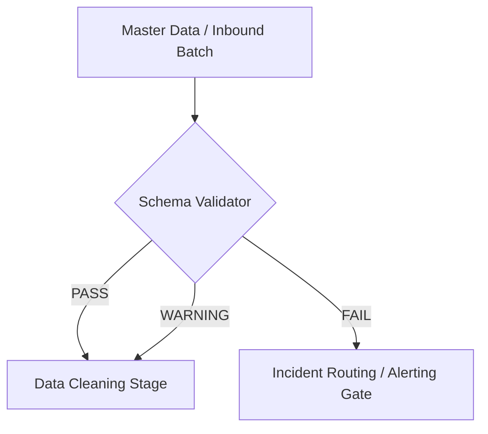

# DataSentinal — Schema Validation Module Guide

## 1. Purpose & Overview

The **Schema Validation Module** functions as an early structural gate in the System 1 Representative Healthcare Data Pipeline. It performs non-mutating (read-only) schema, structural, and datatype validation on incoming batch files and tables before downstream cleaning, transformation, or feature engineering can occur.



---

## 2. Supported Datasets

1. **Claims Dataset** (`dataset_name: claims`)
   - 197 standard CMS columns + 3 pipeline ingestion metadata columns (`ingestion_timestamp`, `hospital_id`, `batch_id`).
   - Default delimiter: `|` (pipe) or `,` (comma).
   - Grain: **Claim-line grain** (`CLM_ID` + `CLM_LINE_NUM`).
2. **Prior Authorization Dataset** (`dataset_name: authorization`)
   - 8 core authorization fields: `AUTH_ID`, `BENE_ID`, `PRF_PHYSN_NPI`, `HCPCS_CD`, `AUTH_EFF_DT`, `AUTH_EXP_DT`, `AUTH_AMT`, `AUTH_STATUS_CD`.
   - Default delimiter: `,` (comma).
   - Grain: Single primary key (`AUTH_ID`).

---

## 3. Centralized Schema Contracts

All schema contracts are stored in `configs/schemas/*.yaml`:
- [`configs/schemas/claims_schema.yaml`](file:///c:/Users/YUVA/Desktop/Data-Sentinel/UC10_PipelineMonitor_DataSentinel/configs/schemas/claims_schema.yaml)
- [`configs/schemas/authorization_schema.yaml`](file:///c:/Users/YUVA/Desktop/Data-Sentinel/UC10_PipelineMonitor_DataSentinel/configs/schemas/authorization_schema.yaml)

### Schema Contract Definition Fields
```yaml
dataset_name: claims
version: "1.0.0"
primary_key:
  - CLM_ID
  - CLM_LINE_NUM
default_delimiter: "|"
allow_additional_columns: true
strict_mode: false

fields:
  - name: BENE_ID
    type: string
    required: true
    nullable: false
  - name: CLM_FROM_DT
    type: date
    required: true
    nullable: false
    date_formats:
      - "%d-%b-%Y"
      - "%Y-%m-%d"
      - "%Y%m%d"
  - name: CLM_PMT_AMT
    type: float
    required: true
    nullable: false
```

---

## 4. Validation Rules & Checks

| Check Category | Check Name | Severity | Description |
|---|---|---|---|
| **FILE_STRUCTURE** | `file_exists` | `CRITICAL` | Verifies file existence on disk |
| **FILE_STRUCTURE** | `file_readable` | `CRITICAL` | Verifies non-corrupt readability |
| **FILE_STRUCTURE** | `non_empty_file` | `CRITICAL` | Flags 0-byte or blank files |
| **COLUMNS** | `no_duplicate_columns` | `ERROR` | Detects repeated headers in the CSV |
| **COLUMNS** | `required_columns_present` | `ERROR` | Verifies presence of all required fields |
| **COLUMNS** | `no_unexpected_columns` | `ERROR` | Flags undeclared columns under strict mode |
| **COLUMNS** | `additional_columns_info` | `INFO` | Notifies about optional extra columns |
| **NULLABILITY** | `non_nullable_field` | `ERROR` | Flags nulls/blanks in mandatory fields |
| **DATA_TYPES** | `integer_type` | `ERROR` | Validates parseability as integer |
| **DATA_TYPES** | `float_type` | `ERROR` | Validates parseability as float/decimal |
| **DATA_TYPES** | `allowed_values` | `ERROR` | Validates categorical domain membership |
| **DATE_FORMATS** | `date_format` | `ERROR` | Validates conformance to expected date formats |
| **KEYS** | `primary_key_uniqueness` | `ERROR` | Validates composite/primary key uniqueness |

---

## 5. Result Contract & Status Semantics

- **`PASS`**: All structural and schema checks passed with zero errors. Pipeline execution proceeds.
- **`WARNING`**: Non-critical warnings detected (e.g. additional optional columns present or 0 data rows). Pipeline may proceed with notification.
- **`FAIL`**: One or more critical/error violations encountered (missing required column, malformed dates, invalid types, duplicate primary keys). Pipeline execution stops.

### Result Object Structure (`ValidationResult`)
```json
{
  "dataset": "claims",
  "file": "data/batches/hospital_A/batch_20150316.csv",
  "status": "PASS",
  "passed": true,
  "total_rows": 125,
  "total_columns": 200,
  "error_count": 0,
  "warning_count": 0,
  "execution_time_seconds": 0.0443,
  "issues": []
}
```

---

## 6. Pipeline Integration Interface

```python
from src.validation import validate_dataset, format_validation_summary

# 1. Validate a file
result = validate_dataset("claims", "master_data/batches/hospital_A/batch_20150316.csv")

if not result.passed:
    print(format_validation_summary(result))
    # Route to pipeline incident handling
    raise ValueError(f"Batch failed schema validation: {result.error_count} errors")

# 2. Or validate an in-memory DataFrame
from src.validation import SchemaValidator, load_schema_by_name

validator = SchemaValidator(load_schema_by_name("authorization"))
auth_result = validator.validate_dataframe(auth_df)
```

---

## 7. How to Run Tests

```bash
# Run all unit and master-data validation tests
python -m unittest discover -s tests/validation -p "test_*.py" -v
```

---

## 8. How to Add or Update a Schema

1. Create or edit a YAML file in `configs/schemas/<dataset_name>_schema.yaml`.
2. Specify `primary_key`, `default_delimiter`, and `fields`.
3. Add a unit test in `tests/validation/` to ensure full coverage.
