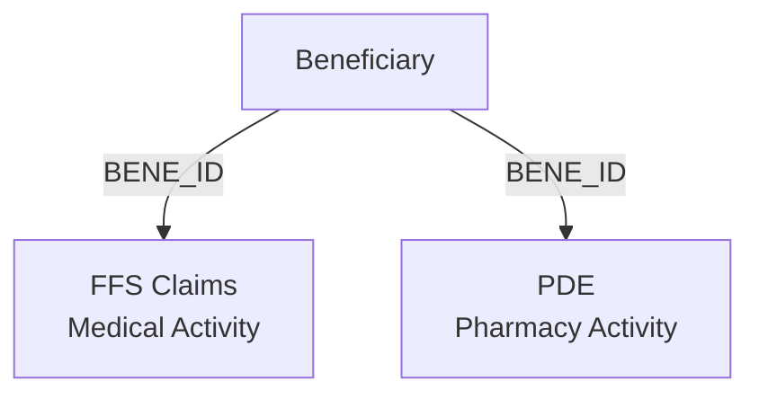
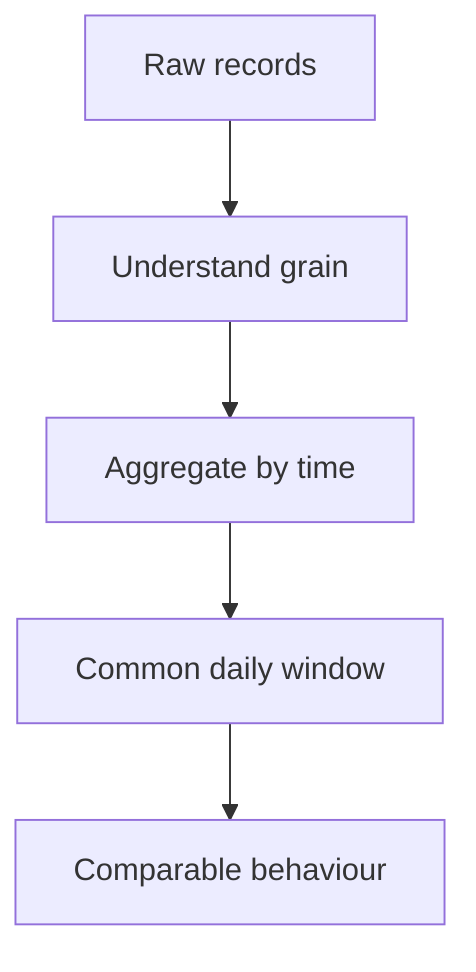
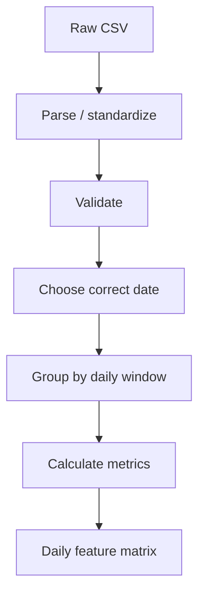
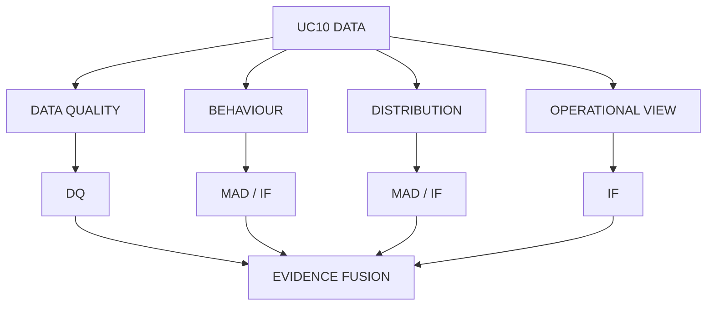
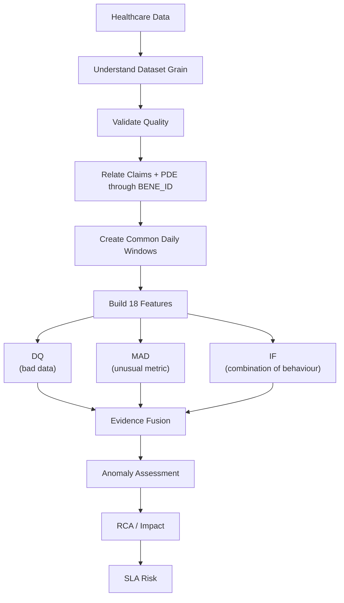

# UC10 — CANONICAL DATA KNOWLEDGE GUIDE
## Data-First, Feature-First, Detector-Second

## SECTION 1 — WHAT DATA DO WE HAVE?

We rely on three core synthesized CMS datasets. The following metrics reflect the exact audited state of our data sample:

| Dataset | What it represents | Grain | Key | Important date | Why UC10 uses it |
|---|---|---|---|---|---|
| **Beneficiary** | member/reference view | 1 row per beneficiary | `BENE_ID` | (Reference) | Master population list |
| **FFS Claims** | medical activity | claim-line grain | `CLM_ID` / `CLM_LINE_NUM` | `CLM_FROM_DT` / `NCH_WKLY_PROC_DT` | Baseline medical volume |
| **PDE** | pharmacy activity | event-level grain | `PDE_ID` | `SRVC_DT` | Baseline pharmacy volume |

**Audited Dataset Facts:**
- **Beneficiary:** 5,975 rows, 123 columns.
- **FFS Claims:** 1,121,004 rows, 96 columns. Maps to 90,705 unique claims across 7,971 unique beneficiaries.
- **PDE:** 515,520 rows, 36 columns. Maps to 515,520 unique events across 7,403 unique beneficiaries.

---

## SECTION 2 — HOW ARE THE DATASETS RELATED?

`BENE_ID` acts as the primary relational key bridging medical and pharmacy activity.

**Audited Relationship Findings:**
- Total Beneficiaries in Master: 5,975
- Intersection (Claims + PDE): 6,850 beneficiaries have both medical and pharmacy events.
- **Orphan Claims:** 2,436 unique beneficiaries in Claims do not exist in Beneficiary.
- **Orphan PDEs:** 2,018 unique beneficiaries in PDE do not exist in Beneficiary.

**What this means for UC10:**
We do not possess perfect referential integrity. These orphan records are not a mistake to be silently cleaned; they serve as active Data Quality (DQ) evidence that the anomaly detectors monitor.

---

## SECTION 3 — WHY GRAIN MATTERS

Understanding the data "grain" is critical:
- **Beneficiary:** 1 row = 1 beneficiary
- **Claims:** 1 row = 1 claim line
- **PDE:** 1 row = 1 prescription event

Because a single complex medical claim can generate hundreds of line items, comparing raw claim rows directly to single-event pharmacy rows is meaningless. 

We must aggregate these varying granularities into a daily window before the data can be analyzed.

---

## SECTION 4 — FROM RAW RECORDS TO DAILY DATA

The machine learning model does not directly consume millions of raw healthcare records. It consumes a compact daily representation of behaviour.

This transformation guarantees that our anomaly detection layer is evaluating true daily patterns rather than raw, noisy transaction lines.

---

## SECTION 5 — THE FOUR DATA ASPECTS

We extract four distinct types of evidence from the daily data.

### A. DATA QUALITY
**Question:** "Is the data valid?"
**Features:** `null_rate`, `duplicate_rate`, `claims_null_rate`, `cross_dataset_mismatch_rate`, `dq_violation_rate`

### B. HEALTHCARE VOLUME / BEHAVIOUR
**Question:** "Is healthcare activity behaving normally?"
**Features:** `claim_count`, `pde_count`, `unique_beneficiary_count`, `unique_provider_count`, `claim_pde_ratio`, `volume_change_pct`

### C. DISTRIBUTION
**Question:** "Have the characteristics of the data changed?"
**Features:** `median_days_supply`, `median_rx_cost`, `median_claim_amount`

### D. OPERATIONAL TELEMETRY (PROTOTYPE-SIMULATED)
**Question:** "Is the pipeline processing normally?"
**Features:** `processing_duration`, `throughput`, `failure_rate`, `backlog`

---

## SECTION 6 — FEATURE DICTIONARY

Our feature engineering produces exactly 18 final features.

| Feature | Built from | What it tells us | Aspect | Detector |
|---|---|---|---|---|
| `claim_count` | FFS Claims | daily medical activity volume | healthcare behaviour | MAD / IF |
| `pde_count` | PDE | daily pharmacy activity volume | healthcare behaviour | MAD / IF |
| `unique_beneficiary_count` | Claims + PDE | unique patients active | healthcare behaviour | IF |
| `unique_provider_count` | Claims + PDE | unique billing providers | healthcare behaviour | IF |
| `claim_pde_ratio` | Claims + PDE | relationship between medical and pharmacy activity | cross-dataset behaviour | IF |
| `volume_change_pct` | Derived | week-over-week or day-over-day volatility | healthcare behaviour | MAD |
| `median_days_supply` | PDE | shift in prescription duration | distribution | MAD / IF |
| `median_rx_cost` | PDE | shift in average drug prices | distribution | MAD / IF |
| `median_claim_amount` | FFS Claims | shift in average medical billing | distribution | MAD / IF |
| `null_rate` | DQ checks | missing critical identifiers across files | data quality | DQ |
| `duplicate_rate` | DQ checks | repeating identical primary keys | data quality | DQ |
| `claims_null_rate` | DQ checks | missing diagnosis or provider codes | data quality | DQ |
| `cross_dataset_mismatch_rate` | Claims + PDE | orphan records missing BENE_ID references | data quality | DQ |
| `dq_violation_rate` | DQ checks | overall data rule failures | data quality | DQ |
| `processing_duration` | Pipeline metrics | batch processing execution time | operational | IF / SLA |
| `throughput` | Pipeline metrics | processed records per second | operational | IF / SLA |
| `failure_rate` | Pipeline metrics | failed processing tasks | operational | IF / SLA |
| `backlog` | Pipeline metrics | volume of pending work | operational | IF / SLA |

---

## SECTION 7 — FEATURE &rarr; ASPECT &rarr; DETECTOR

| Data Aspect | Features | Main Question | Primary Detector |
|---|---|---|---|
| Data Quality | `null_rate`, `duplicate_rate`, etc. | Is data invalid? | DQ |
| Volume | `claim_count`, `pde_count` | Is volume unusual? | MAD |
| Cross-data behaviour | `claim_pde_ratio` | Are streams behaving differently? | IF |
| Distribution | `median_rx_cost`, etc. | Has the distribution shifted? | MAD / IF |
| Operational | `throughput`, `backlog`, etc. | Is processing degrading? | IF / SLA |

---

## SECTION 8 — WHY EACH DETECTOR EXISTS

**DQ (Data Quality Rules):**
"Something is explicitly wrong."
- *Example:* Missing `BENE_ID` &rarr; DQ

**MAD (Statistical Rolling Median Absolute Deviation):**
"One measurement is unusually different from its recent normal."
- *Example:* 40% sudden volume drop on a Tuesday &rarr; MAD

**Isolation Forest (Machine Learning):**
"Several measurements look unusual together."
- *Example:* Volume is slightly abnormal + throughput is decreasing + backlog is increasing &rarr; Isolation Forest

---

## SECTION 9 — WHAT IS REAL AND WHAT IS SIMULATED?

The current CMS datasets describe healthcare activity, not live pipeline execution. Operational telemetry is therefore simulated for the prototype.

| REAL DATA | SIMULATED OPERATIONAL TELEMETRY |
|---|---|
| `claim_count`   `pde_count`   beneficiary counts   provider counts   median costs   median days supply   DQ metrics   cross-data relationships | `processing_duration`   `throughput`   `failure_rate`   `backlog`   SLA-related metrics |

---

## SECTION 10 — ANOMALY COVERAGE

| Anomaly | Evidence | Feature | Detector |
|---|---|---|---|
| Missing ID | null identifier | `null_rate` | DQ |
| Duplicate | repeated record/key | `duplicate_rate` | DQ |
| Invalid date | invalid date | `dq_violation_rate` | DQ |
| Referential mismatch | orphan/reference mismatch | `cross_dataset_mismatch_rate` | DQ |
| Volume drop | sudden volume change | `claim_count` / `pde_count` | MAD |
| Multivariate degradation | several abnormal metrics | behavioural/operational features | IF |

---

## SECTION 11 — COMPLETE DATA STORY

---

## SECTION 12 — WHAT THIS DATA CAN AND CANNOT PROVE

**CAN SUPPORT:**
- healthcare activity monitoring
- data quality monitoring
- cross-dataset consistency analysis
- temporal volume anomaly detection
- multivariate behavioural anomaly detection
- prototype SLA modelling using simulated telemetry

**CANNOT DIRECTLY PROVIDE:**
- real production pipeline execution telemetry
- real processing duration
- real queue backlog
- real production SLA deadlines
- real prior authorization workflow data
- real authentication/authorization transactions

---

## SECTION 13 — FINAL TAKEAWAY

The UC10 data foundation converts heterogeneous healthcare records into a common daily behavioural view. The resulting features provide different types of evidence: data-quality evidence, volume and behaviour evidence, distribution evidence, and prototype operational evidence. Each evidence type is sent to the detector best suited to identify that type of anomaly.

**DATA FOUNDATION STATUS: READY TO FREEZE**
