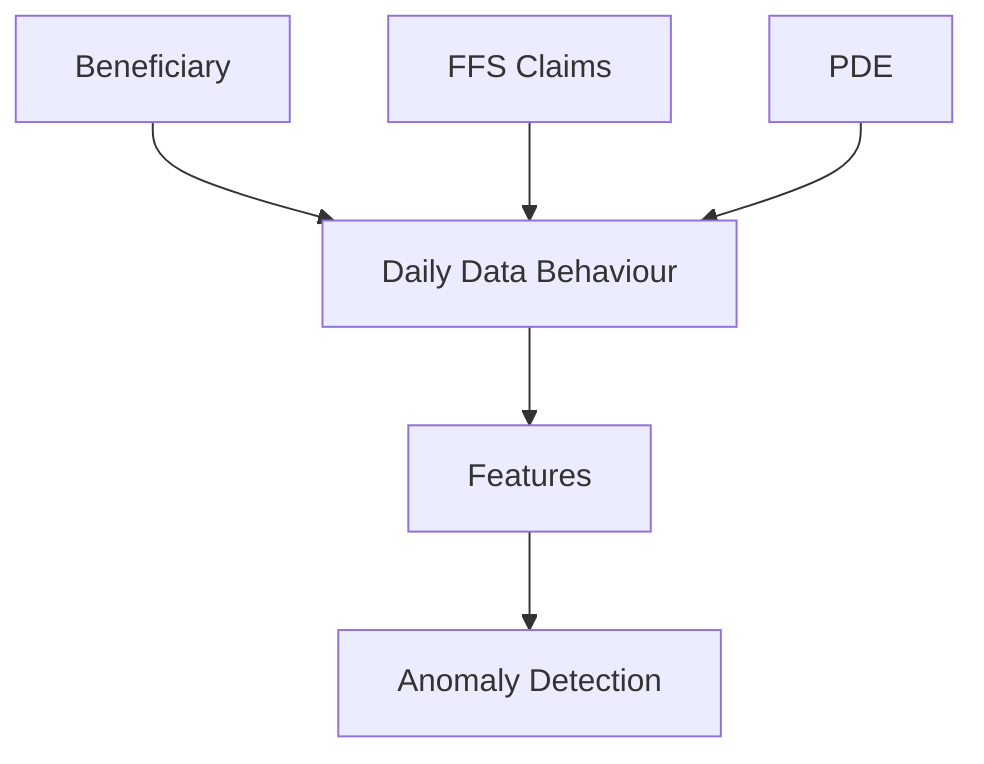
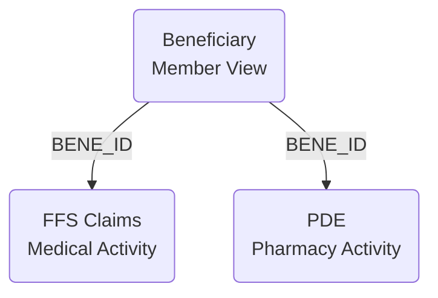
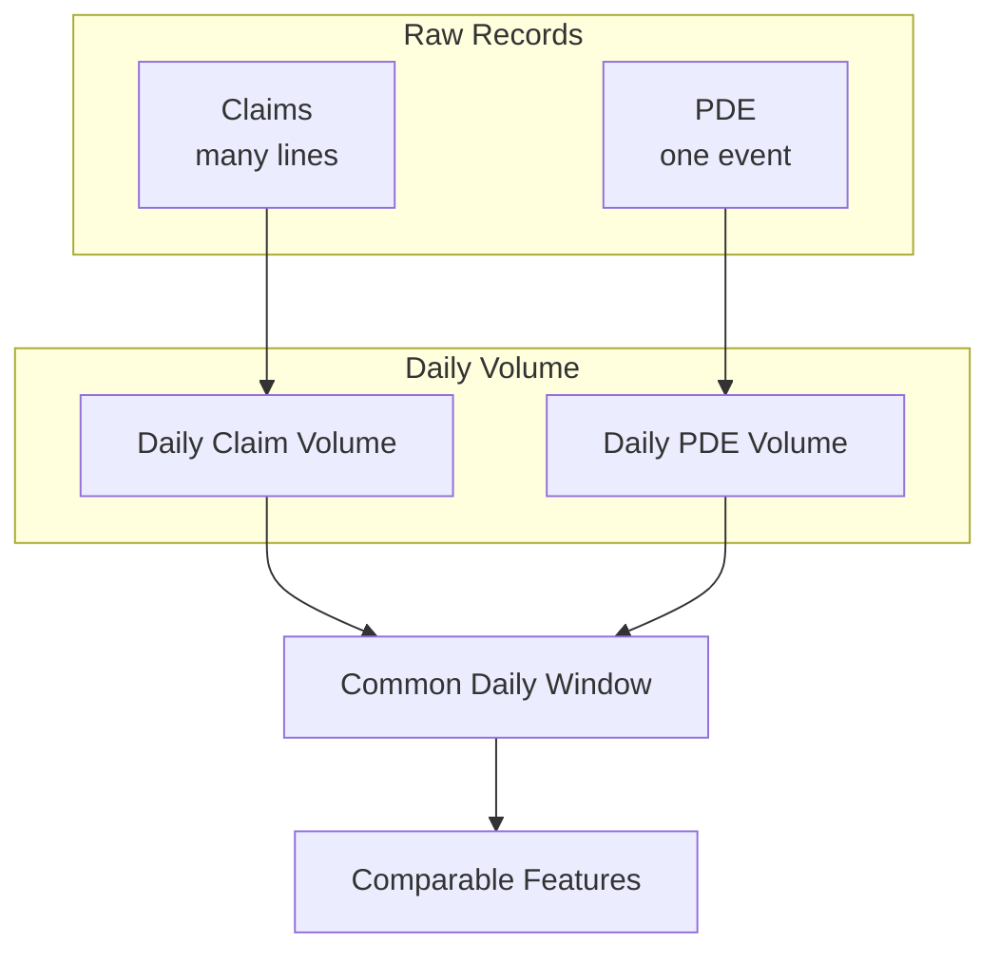
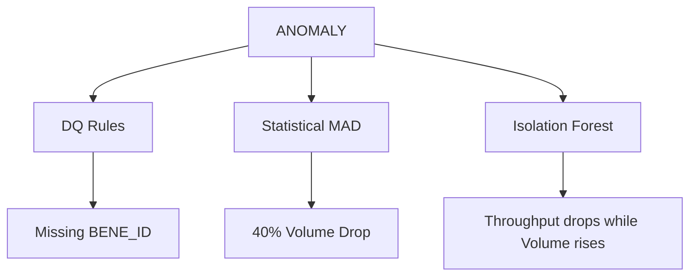
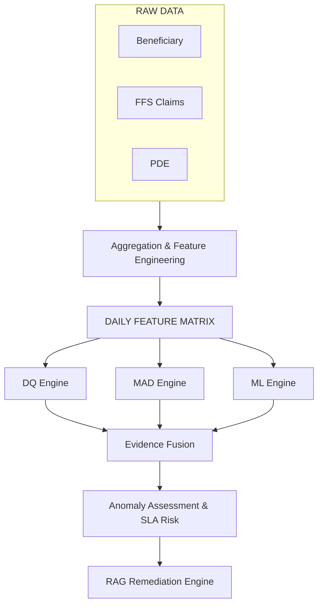

# UC10 &mdash; Data Knowledge Guide
**The Data Story: From Problem Statement to Anomaly Detection**

## 1. The Problem Statement & UC10 Goals

Medicare data pipelines process hundreds of millions of records per day. If part of the pipeline fails, or if data quality degrades silently, downstream analytical systems will produce incorrect insights. The UC10 initiative was designed to solve this by building an autonomous anomaly detection and remediation layer.

**The Challenge:** Healthcare datasets are massive and highly volatile. Simple thresholds or standard deviation alerts fail because standard activity drops naturally on weekends. Furthermore, pipeline processing delays (SLA breaches) are deeply intertwined with the complexity and volume of the underlying data.

**How the Data is Used:** We use a sample of three foundational CMS datasets (Beneficiary, Claims, and PDE) to reconstruct the pipeline's operational and data quality behavior. By tracking the relationships and daily volumes of these datasets, we can train algorithms to distinguish between normal weekend drops, data quality failures, and systemic processing slowdowns.

## 2. The Data in One View

We rely on three core datasets to understand patient activity:

### Beneficiary Master
- **What it represents:** The master record of members in the sample.
- **Grain:** One row per beneficiary.
- **Key:** `BENE_ID`

### FFS Claims
- **What it represents:** Medical billing activity.
- **Grain:** Claim-line level. A single hospital visit generates multiple rows.
- **Keys:** `CLM_ID` / `CLM_LINE_NUM`, linking to `BENE_ID`.

### PDE (Prescription Drug Events)
- **What it represents:** Pharmacy activity.
- **Grain:** One row per prescription event.
- **Keys:** `PDE_ID`, linking to `BENE_ID`.

## 3. Feature Engineering: Why Grain Matters

Before we can detect anomalies, we must normalize the data. The core challenge of feature engineering for UC10 was resolving the mismatched grain between the datasets.

- **Beneficiary:** one row = one beneficiary
- **Claims:** one row = one claim line
- **PDE:** one row = one prescription event

If we monitored raw row counts, a few complex medical claims would artificially look like a massive spike in activity compared to pharmacy prescriptions. To fix this, we aggregate all activity into a **Common Daily Window**.

## 4. The Data Story: How We Engineered the Features

Millions of raw records are impossible for a machine learning model to monitor directly. We grouped the records by date and calculated 18 critical daily metrics to form our **Feature Matrix**.

> [!WARNING]
> **The Referential Integrity Discovery:**
> During profiling, we discovered "Orphan" Claims and PDEs—records where the `BENE_ID` did not exist in the Beneficiary master table. In a traditional pipeline, these might be silently dropped. In UC10, we engineered the feature `cross_dataset_mismatch_rate` to ensure this missing relationship acts as a detectable anomaly signal.

## 5. The Four Feature Groups

The final feature matrix is organized into four architectural groups:

### GROUP 1: DATA QUALITY
- **Goal:** Detect if the data itself is invalid or missing.
- **Features:** `null_rate`, `duplicate_rate`, `claims_null_rate`, `cross_dataset_mismatch_rate`, `dq_violation_rate`

### GROUP 2: HEALTHCARE DATA VOLUME / BEHAVIOUR
- **Goal:** Track healthcare activity volatility and relationships.
- **Features:** `claim_count`, `pde_count`, `unique_beneficiary_count`, `unique_provider_count`, `claim_pde_ratio`, `volume_change_pct`

### GROUP 3: DISTRIBUTION
- **Goal:** Identify shifts in the clinical/financial characteristics of the data.
- **Features:** `median_days_supply`, `median_rx_cost`, `median_claim_amount`

### GROUP 4: OPERATIONAL TELEMETRY
- **Goal:** Monitor if the pipeline processing SLA is degrading.
- **Features:** `processing_duration`, `throughput`, `failure_rate`, `backlog`
*(Note: These operational metrics are mathematically simulated for the prototype to demonstrate SLA monitoring, representing downstream systems.)*

## 6. Feature &rarr; Detector Mapping

Not every anomaly looks the same. UC10 uses a Tri-Level detection architecture mapped explicitly to our feature groups.

| Detector | Purpose | Feature Groups Used |
|---|---|---|
| **1. DQ Rules** | Detects explicit invalidation (nulls, duplicates, bad formats). | Data Quality |
| **2. Rolling MAD** | Median Absolute Deviation detects massive single-metric spikes or drops, ignoring weekend volatility. | Volume, Distribution |
| **3. Isolation Forest** | Machine Learning detects subtle, complex degradation where multiple metrics drift slightly off-trend together. | Behaviour, Operations |

## 7. Complete Data Journey & Anomaly Coverage

The resulting architecture provides comprehensive coverage against all critical failure modes.

| Problem Scenario | Primary Feature Flagged | Primary Detector |
|---|---|---|
| Missing Identifiers | `null_rate` | DQ Rules |
| Duplicate Records | `duplicate_rate` | DQ Rules |
| Orphan Claims | `cross_dataset_mismatch_rate` | DQ Rules / MAD |
| Unexpected Missing Data | `claim_count` / `pde_count` | Statistical MAD |
| Silent System Slowdown | `throughput` + `backlog` | Isolation Forest |

---
**The data layer is now fully mapped, engineered, and frozen. It successfully drives the UC10 autonomous detection architecture.**
