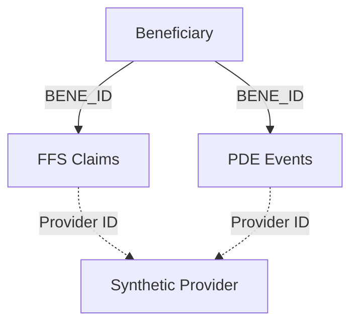
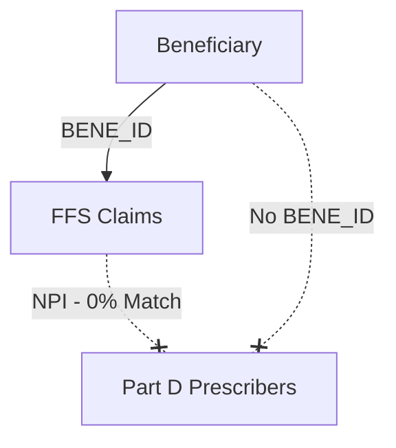

# 02 Dataset Relationship Analysis

We performed empirical data overlap analysis on the local datasets to verify relationships.

## Data Relationship Matrix

| Source | Target | Key | Match % | Cardinality | Verified? | Use |
|---|---|---|---:|---|---|---|
| Beneficiary | PDE | `BENE_ID` | 100.0% | 1:M | YES | Cross-validation |
| Beneficiary | FFS (Inpatient) | `BENE_ID` | 100.0% | 1:M | YES | Cross-validation |
| PDE | Part D Prescribers | `PRSCRBR_ID` / `Prscrbr_NPI` | 0.0% | M:1 | NO | Relationship Not Verified |
| Beneficiary | Part D Prescribers | `BENE_ID` | 0.0% | N/A | NO | Relationship Not Verified |

## Logical Architecture Graphs

### Architecture A (Beneficiary + FFS + PDE)

*Meaningful and verifiable relationships exist at the beneficiary/event level.*

### Architecture B (Beneficiary + FFS + Part D Prescribers)

*The connection between the synthetic ecosystem and the real Part D Prescribers PUF is completely broken (0% overlap).*
